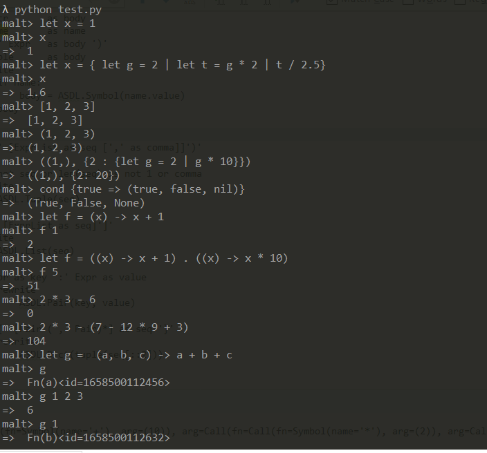

The Malt Programming Language

## 马特语言， 只需要四分之一个整日，你就能实现！

- [而这个方法只需要十分钟就能掌握](https://github.com/thautwarm/RBNF)

特性:

- auto currying
- lambda only
- scalable operators
- weird enough statement separator(`|`)
- first-class expression

## 为什么我能在短短几个小时内实现它？

- `Malt` is simple
- I use [rbnf](https://github.com/thautwarm/RBNF), which is an alternative of `RegExp` tools, and can help you solve any text processing tasks no matter how difficult you once thought it to be.

## Related

See rbnf syntaxes of `malt` here:
- [https://github.com/thautwarm/rmalt/blob/master/rmalt/malt.rbnf](https://github.com/thautwarm/rmalt/blob/master/rmalt/malt.rbnf)

What is `rbnf`?

- See [https://github.com/thautwarm/RBNF](https://github.com/thautwarm/RBNF).

- It's (**more than**) a parser generator, and a solution to text with very complex structure.

Run the `repl` with `python test.py` with following requirements
- (`Redy>=0.1.23, rbnf>=0.1.8`)! 

Oh you mean this repo is too informal? It's unnecessary to write a `setup` file cause it's just an example to bring you a piece about how to write programming langauge!

